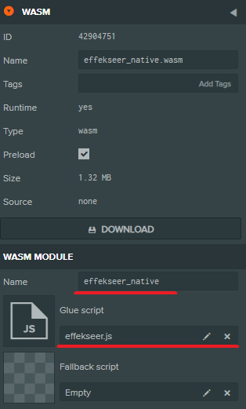
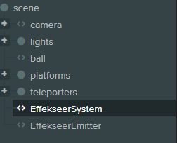
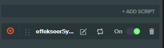
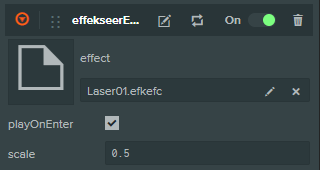

# PlayCanvas with EffekseerForWebGL

- [Official website](http://effekseer.github.io)
- [Effekseer repository](https://github.com/effekseer/Effekseer)
- [EffekseerForWebGL repository](https://github.com/effekseer/EffekseerForWebGL)

## How to use

### PlayCanvas Editor

Import all files in src/

Specify a name and a script into effekseer_native.wasm



Add entities



Add EffekseerSystem to an entity



Add EffekseerEmitter to an entity

Specify efkefc file.



Effect can be played with this code

```
this.entity.script.effekseerEmitter.play();
```

Please look at PlayCanvas Project in a detail.

[Project](https://playcanvas.com/project/649529/overview/effekseersimplesample)

## Development

### How to copy from EffekseerForWebGL

- Rename

effekseer.wasm -> effekseer_native.wasm

- Fix code

```
effekseer_native(params).then(function (module) {
```

to

```
effekseer_nativeLib(params).then(function (module) {
```